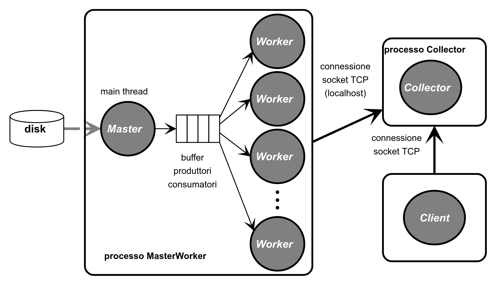

# BigFarm

## Progetto per il corso di Laboratorio II presso l'università di Pisa.

È richiesta la realizzazione dello schema di connessioni sottostante.



Il progetto consiste in tre diversi file che svolgono la funzione di *produttore-consumatore* (eseguibile `farm.c`), *server* (eseguibile `collector.py`) e *client* (eseguibile `client.c`). Sono presenti anche i files

- `libBigFarm.h`  con funzioni usate in `farm.c` e `client.c`

- `somme.py` che calcola la somma per tutti i file passati sulla linea di comando

- `gensomma.py` che genera un file con un numero assegnato di `long` e una somma assegnata

- `z0.dat` contenente 3 `long` con somma 9876543210

- `z1.dat` contenente 3 `long` con somma -1
  
  Vediamo più nello specifico.

## Farm.c

Questo programma, scritto in linguaggio C, riceve da riga di comando una serie di opzioni

- `-n` per specificare il numero di thread del *consumatore*

- `-q` per specificare la lunghezza del buffer *produttore-consumatore*

- `-t` per specificare il tempo (in millisecondi) da far passare tra due scritture sul buffer

ognuno con i propri valori di default, e una serie di nomi di file in formato stringa.

Dopo i controlli del caso vengono generati `n` thread e ogni nome file viene scritto nel buffer ogni `t` millisecondi. Questa ultima operazione viene interrotta nel caso venga ricevuto un segnale `SIGINT`. Sia che il programma termini correttamente che nel caso di interruzione prematura a causa di un segnale viene scritto sul buffer per ogni posizione la stringa `"FINE"` in modo da avvisare tutti i thread *consumatore*. Avviene poi, prima della conclusione del programma, la chiusura e la deallocazione degli oggetti precedentemente allocati.

Il funzionamento dei thread (funzione `tbody`) è il seguente; viene letto dal buffer il nome del file, se è un file esistente si procede a leggerne i long contenuti e fare la somma. Per finire viene spedita la coppia `[sommaFile,nomeFile]` tramite *socket* al *server* (con la funzione `invioCoppia`). 

## Collector.py

Questo programma, scritto in linguaggio Python, svolge il ruolo di server e gestisce 3 tipi di richieste. Queste stesse sono identificate dall'arrivo di un primo intero. In particolare:

- `1` nel caso il programma `client.c` richieda l'invio di tutte le coppie presenti sul *server*.

- `2` nel caso il programma `client.c` richieda la ricerca di una data somma (o una serie di esse) all'interno delle coppie già presenti sul *server*. Nel caso esista verrà inviata al *client*, nel caso contrario verrà inviata la stringa `Nessun File` 

- `3` nel caso il programma `farm.c` invii una nuova coppia `[sommaFile,nomeFile]` da inserire all'interno del *server*

## Client.c

Questo programma, scritto in linguaggio C, svolge il ruolo di *client* e puù inviare al server due tipi di richieste.

Nel caso venga eseguito senza parametri verrà inviata una richiesta di tipologia `1` e si richiederà al *server* (eseguibile `collector.py`) di mandare tutte le coppie `[sommaFile,nomeFile]` in suo possesso.

Se il programma viene eseguito con argomenti (interi di tipo long), essi vengono inviati al *server* (richiesta di tipologia `2`) che ci si aspetta ritorni un messaggio con la stringa `Nessun File` nel caso non esistesse una coppia con la data somma mentre la stringa contentente la somma e il file rispettivo in alternativa.

# Test:

Per testare il tutto si richiede di eseguire i seguenti comandi:

```
git clone git@github.com:user/progetto.git
cd progetto 
make
./collector.py &
./client -1
./farm z?.dat
./client 9876543210 1
./client
```

con il seguente output:

```
Nessun file        (risposta alla richiesta di somma -1)
9876543210 z0.dat  (risposta alla richiesta di somma 9876543210)
Nessun file        (risposta alla richiesta di somma 1)
        -1 z1.dat  (risposta alla richiesta di tutte le coppie)
9876543210 z9.dat
```